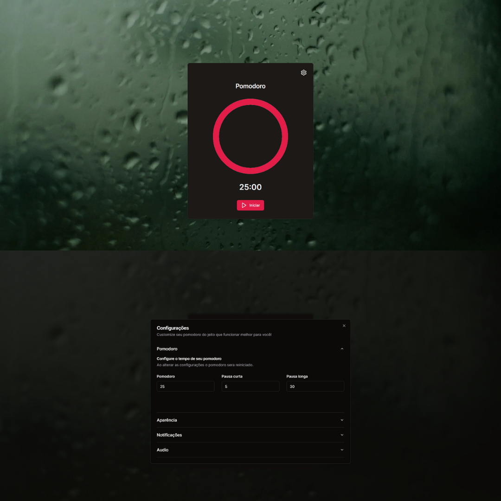
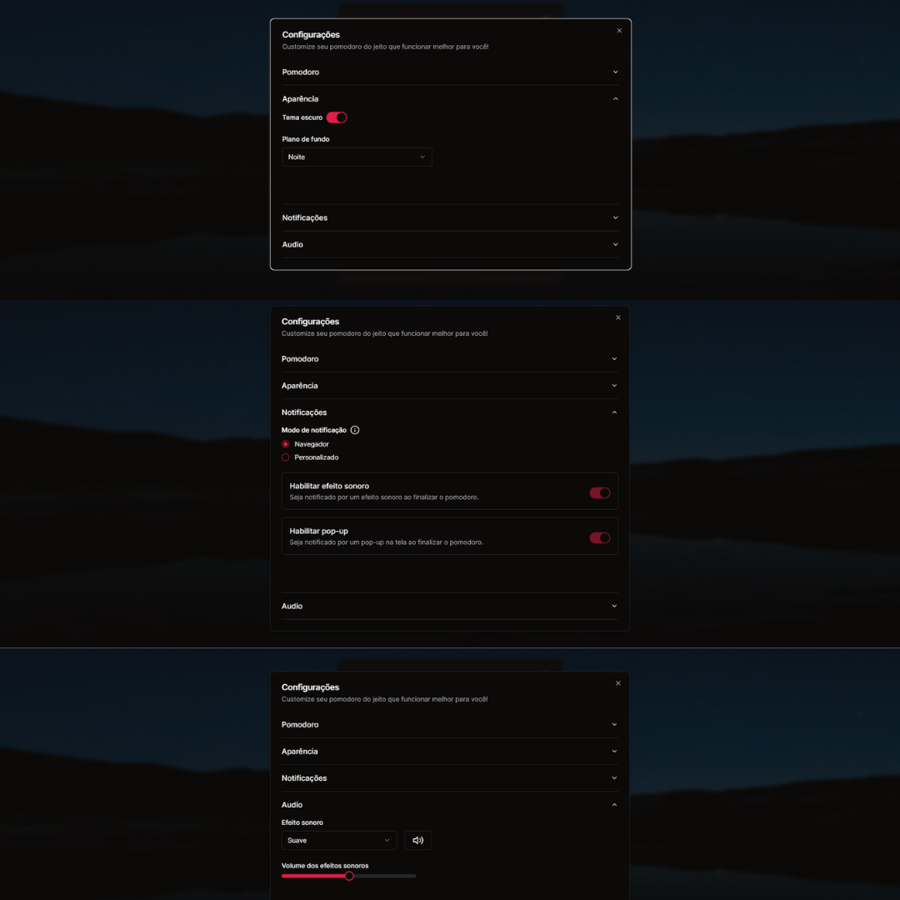

# Workstation

⚛️ A **Next.js** highly customizable pomodoro

### [Live Demo](https://workstation-gray.vercel.app/)




If you want to take a look on all screens of the App, click [here](https://drive.google.com/drive/folders/1-P-7KHrSf1AxC7WvsgOw9Y2SVyxCA94J?usp=sharing).

## About this Project

The idea of the App is:

_"Improve productivity by using the pomodoro technique and allowing a lot of customization"._

## Why?

This project contributes to my personal portfolio, and I would greatly appreciate any feedback you could offer on the project, whether it's related to the code, structure, or any aspect that you believe could contribute to my growth as a developer. Your insights are valuable, and I welcome any constructive criticism to improve my skills.

## Functionalities

- Improve your productivity using the pomodoro technique

- Customize your pomodoro period however you want

- Personalize the appearance for a more welcoming workplace

- Customize notifications to suit your preferences

## Observations

This Project is under development, so any feedback will be appreciated

## Getting Started

First, run the development server:

```bash
npm run dev
# or
yarn dev
# or
pnpm dev
# or
bun dev
```

Open [http://localhost:3000](http://localhost:3000) with your browser to see the result.

## License

This project is licensed under the MIT License - see the [LICENSE](https://github.com/NicolasJardin/workstation/blob/main/LICENSE) file for details
